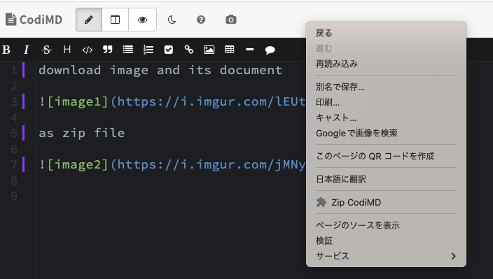

# CodiMD Zipper

[Download](https://github.com/tyage/codimd-zipper/releases)

CodiMD Zipper is a browser extension that downloads CodiMD documents as zip file with images.

Maybe it works with HackMD :)

## Known issue

You have to reload document page if you want to call CodiMD Zipper twice or more times in the page.
